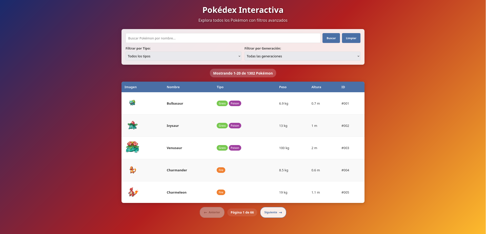
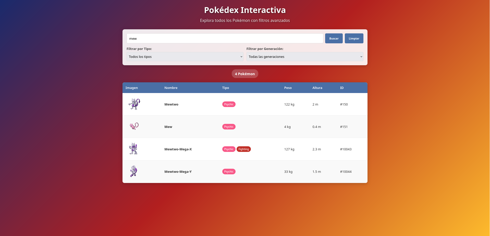
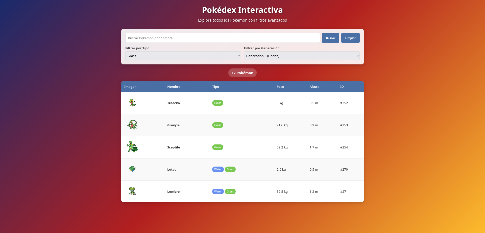
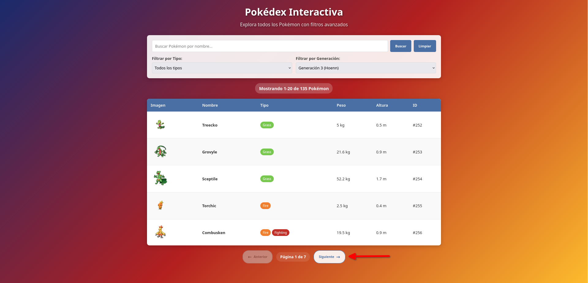
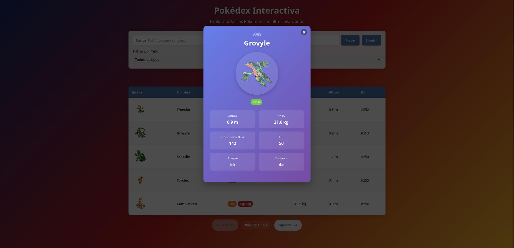

# Pokédex Interactiva
Una aplicación web moderna que consume la **PokéAPI** para mostrar información de Pokémon con filtros avanzados y búsqueda en tiempo real.

## Puede acceder a la aplicación dando clic en el siguiente enlace

[https://www.pokeapi-semujer.duckdns.org/](https://www.pokeapi-semujer.duckdns.org/)

---

## 🚀 Características

### 📊 Tabla de Pokémon Completa
- **Imagen**: Sprite oficial de cada Pokémon
- **Nombre**: Nombre en formato capitalizado
- **Tipo**: Badges de colores para cada tipo (18 tipos disponibles)
- **Peso y Altura**: Convertidos a unidades reales (kg y metros)
- **ID**: Número de Pokédex con formato #001

### 🔍 Sistema de Búsqueda
- **Búsqueda en tiempo real**: Filtra mientras escribes
- **Debounce automático**: Espera 500ms antes de buscar para optimizar rendimiento
- **Búsqueda case-insensitive**: No importa mayúsculas/minúsculas

### 🎯 Filtros Avanzados
- **Filtro por Tipo**: 18 tipos diferentes (Agua, Fuego, Eléctrico, etc.)
- **Filtro por Generación**: 9 generaciones desde Kanto hasta Paldea
- **Combinación de filtros**: Puedes usar búsqueda + tipo + generación simultáneamente

---

## 🔌 Conexión a la API

La aplicación se conecta a la **PokéAPI**:  
`https://pokeapi.co/api/v2/`

### Endpoints utilizados
- `GET /pokemon?limit={count}` → Lista todos los Pokémon  
- `GET /pokemon/{id|name}` → Detalles específicos de un Pokémon  
- `GET /type/{type}` → Información de tipos (para filtros)  

---

## 🛠️ ¿Cómo se usa?

### 1. Barra de Búsqueda Principal

- **Campo de texto**: Escribe cualquier nombre (ej: "pikachu", "char")
- **Buscar en tiempo real**: Empieza a filtrar automáticamente al escribir
- **Botón BUSCAR**: Fuerza la búsqueda manual
- **Botón LIMPIAR**: Borra búsqueda y muestra todos los Pokémon

**Ejemplos de búsqueda:**
- `pika` → Encuentra "Pikachu", "Raichu", "Pikachu-Belleza"
- `char` → "Charmander", "Charmeleon", "Charizard"
- `mew` → "Mew", "Mewtwo"

### 2. Sistema de Filtros

#### Filtro por Tipo:

- Selecciona un tipo para ver solo Pokémon de ese tipo
- Ej: "Agua" muestra solo Pokémon tipo agua
- Se combina con la búsqueda por nombre

#### Filtro por Generación:

**Cómo usar:**
- Filtra por región/generación del anime/juego
- Útil para fans de generaciones específicas

### 3. Paginación

**Cómo funciona:**
- **← Anterior**: Ve a la página anterior (deshabilitado en página 1)
- **Página X de Y**: Tu posición actual y total de páginas
- **Siguiente →**: Ve a la página siguiente (deshabilitado en última página)

### 4. Modal de Detalles

**Contenido del modal:**
- **Imagen grande**: Arte oficial o sprite HD
- **Tipos**: Badges igual que en la tabla
- **Estadísticas base**: HP, Ataque, Defensa, Experiencia base
- **Características físicas**: Peso y altura

**Cómo usar:**
- Dar clic sobre un registro

**Cómo cerrar:**
- Botón `X` en la esquina superior derecha
- Clic fuera del modal
- Tecla `ESC` del teclado

---

## 🎨 Diseño y UX

- Interfaz moderna con gradientes y efectos visuales  
- Feedback visual inmediato en todas las acciones  
- Responsive design para móviles, tablets y desktop  
- Loading states con spinner de Pokébola personalizado  
- Manejo de errores con mensajes informativos  

---

## 🔧 Optimizaciones Implementadas

- **Cache de peticiones** → evita llamadas duplicadas a la API  
- **Debounce en búsqueda** → reduce peticiones innecesarias  
- **Paginación del lado cliente** → mejora rendimiento con grandes datasets  
- **Lazy loading** → carga progresiva de imágenes  
- **Manejo de errores** → *graceful degradation* en fallos de red  

---

## 📱 Compatibilidad

✅ Chrome, Firefox, Safari, Edge  
✅ Dispositivos móviles (iOS/Android)  
✅ Tablets y pantallas táctiles  
✅ Navegadores modernos (ES6+)  

---

## 📌 Nota

Esta es una aplicación de demostración para mostrar habilidades en:  

- Consumo de APIs REST  
- JavaScript moderno  
- Desarrollo frontend  
- Optimización de rendimiento  

---